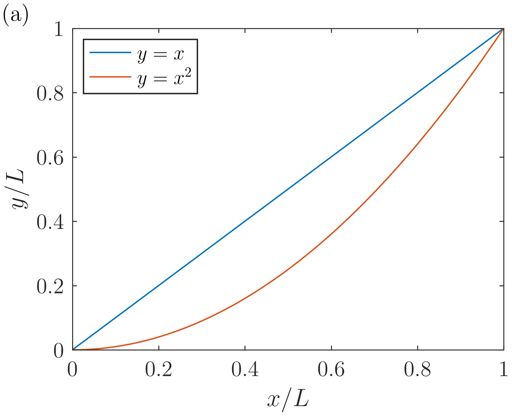
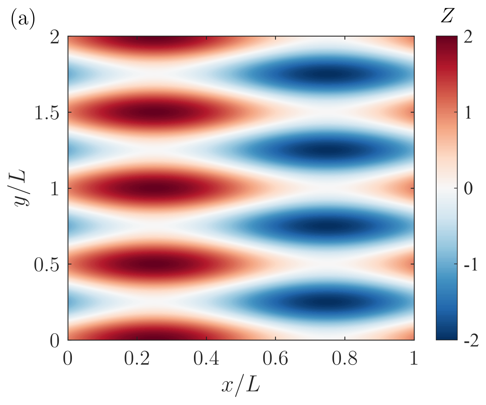

# plot-matlab-style

用于生成接近 MATLAB 风格的 publication-ready Python/Matplotlib 图形，支持线图、semilog、loglog、filled contour、外部 LaTeX 渲染以及 PNG/PDF 输出。

> [!IMPORTANT]
> 本 Skill 使用外部 LaTeX 渲染，不是 Matplotlib 内置 MathText。当前已在 macOS 上验证，Windows 支持尚未测试。

## 样式来源

本 Skill 的论文图样式标定与视觉标准参考自 Penn State University 杨翔教授领导的 [Flow Physics and Computational Research Laboratory (FPCRL)](https://sites.psu.edu/fpcrl/) 课题组的论文绘图风格。

本项目是个人复现与整理，并非 FPCRL 或 Penn State University 的官方发布，也不代表该实验室或学校对本项目的背书。

## 正确效果示例

下面两张图由仓库当前版本的 `matlab_style_plots.py` 直接生成。

### Line plot



### Filled contour



## 安装

将下面这句话直接发送给 Codex：

> 请使用 `$skill-installer` 安装这个 Skill：  
> https://github.com/yuanweibin/plot-matlab-style-skill/tree/main/skills/plot-matlab-style

安装完成后，在下一轮任务中即可使用。如果没有立即出现在 Skill 列表中，请重启 Codex。

## 使用

无需显式指定 Skill，可以直接告诉 Codex：

> 用 Python 画一张 publication-quality 线图，使用 LaTeX 标签，同时输出 PNG 和 PDF。

也可以显式调用：

> 使用 `$plot-matlab-style` 根据这些数据画线图。

Contour 示例：

> 用 Python 画一个带对称 colorbar 的等高线云图，采用 LaTeX 标签并输出 PDF。

## Python 环境

可以使用仓库中的 Conda 环境文件：

```bash
conda env create -f environment.yml
conda activate plot-matlab-style
```

## LaTeX 渲染要求

Skill 使用：

```python
text.usetex = True
```

因此系统需要能够在终端中找到：

- `latex`
- `dvipng`
- `gs`（Ghostscript）

PDF 页面尺寸及字体嵌入检查还会使用：

- `pdfinfo`
- `pdffonts`

可以运行以下命令检查：

```bash
latex --version
dvipng --version
gs --version
pdfinfo -v
pdffonts -v
```

如果缺少 LaTeX 工具，绘图会报错，不会静默退回 MathText。

## 平台状态

| 平台 | 状态 |
| --- | --- |
| macOS | 已测试（Conda + TeX Live） |
| Windows | 尚未测试 |
| Linux | 尚未完整测试 |

Windows 用户需要注意：

- 可以使用 MiKTeX 或 TeX Live 提供 LaTeX。
- Ghostscript 命令可能是 `gswin64c.exe`，而当前脚本检查的是 `gs`。
- Poppler 的 `pdfinfo` 和 `pdffonts` 需要单独安装并加入 `PATH`。

因此，当前版本暂不保证 Windows 可以直接运行。欢迎提交 Windows 测试结果或兼容性修复。

## Skill 内容

- 校准后的 MATLAB 风格页面和坐标轴几何
- 线图、semilog、loglog 和 filled contour
- 自动生成 4--6 个规整、均匀间隔的线性坐标刻度
- MATLAB 默认线条配色与 `RdBu_r` contour 配色
- 外部 LaTeX 字体渲染
- 300 dpi PNG 与矢量 PDF 输出
- PDF 页面尺寸与字体嵌入检查

关于 Codex Skill 的创建与安装，参见 [OpenAI Build skills 文档](https://learn.chatgpt.com/docs/build-skills)。
